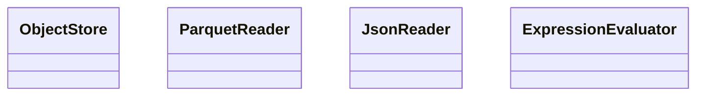
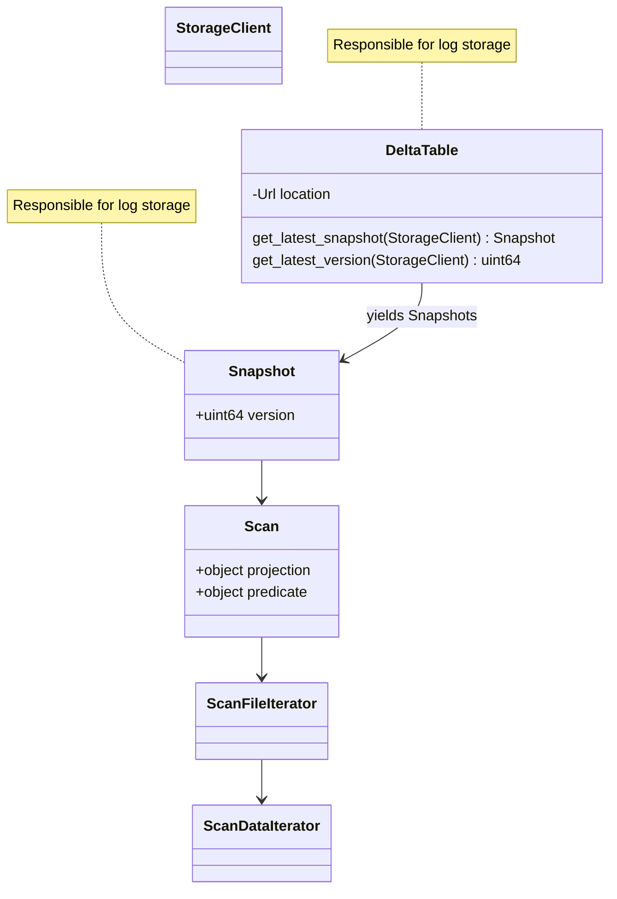

# Architecture

`delta_kernel` crate architecture is still a work in progress!

### Goals

in order of priority (this is placeholder and we need to redo them):
1. simplicity and ease of use (probably too vague)
2. query engine agnostic
3. performance is explicitly secondary goal with the exception of operating in bounded memory

## 10,000-foot view

Two major API surface areas:

1. Engine API
3. Table API

Consider the usage pattern by example: if `delta-rs` wants to leverage
delta\_kernel to read tables, it first must take a dependency on delta\_kernel
and provide any of the traits it wishes (otherwise rely on defaults already
provided in delta\_kernel) - this is API (1) above. Then the engine code can
leverage the table API (2) in order to perform actual interaction with delta
tables.

### Engine API

The engine API aims to provide the least dependency surface as possible, this
means largely using traits to dictate what behavior should be implemented
"above" while placing as much "core" Delta Lake protocol implementation into
the `delta_kernel` crate as possible.

- trait `ObjectStore`
- trait JsonReader
  - arrow-json, simd-json, serde-json, etc
- trait ParquetReader
  - Can DuckDB bring their own Parquer reader an in-memory format
- trait ExpressionEvaluator
  -  datafusion
  -  duckdb's
  -  predominantly used during data skipping, to scan for `where x < 5` based on file skipping
- struct DeltaLog/Segment/Snapshot/Replay
  - generic over the above traits to allow consistent log interactions across table API implementations.

#### Engine Integrations

Ideally there are some engines that would be able to support native Delta Lake integration on top of this API:

* DuckDB
  * Has their own parquet reader and in-memory representation
*  ??

### Table API

The Table API provides a little bit more opinions for handling some Delta Lake
protocol nuance and should be incorporating more deppendencies to provide
`delta_kernel` users with a simpler path to building applications on top of the
Delta Lake protocol..

#### Arrow

Sane defaults for the above traits with `RecordBatch` as the mode of interop between everything. 
This feature flag turns on the most sane default, parquet, json, some expression evaluator
with arrow as its in-memory format.

