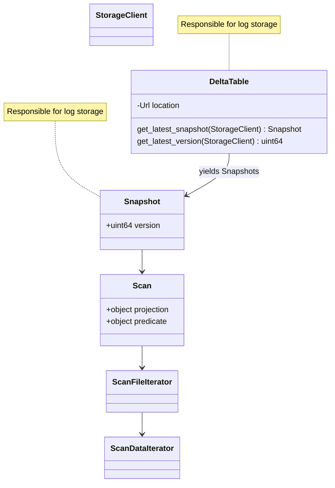

# Architecture

`deltakernel` crate architecture is still a work in progress!

### Goals

in order of priority (this is placeholder and we need to redo them):
1. simplicity and ease of use (probably too vague)
2. query engine agnostic
3. performance is explicitly secondary goal with the exception of operating in bounded memory

## 10,000-foot view

Two major API surface areas:

1. Library/dev API
1. User API

Consider the usage pattern by example: if `delta-rs` wants to leverage
deltakernel to read tables, it first must take a dependency on deltakernel
and provide any of the traits it wishes (otherwise rely on defaults already
provided in deltakernel) - this is API (1) above. Then the library code can
leverage the user API (2) in order to perform actual interaction with delta
tables.

### Library API

The library API aims to provide the least dependency surface as possible, this
means largely using traits to dictate what behavior should be implemented
"above" while placing as much "core" Delta Lake protocol implementation into
the `deltakernel` crate as possible.

main traits:
- StorageClient
- JsonReader
- ParquetReader
- ExpressionEvaluator

### User API

The user API provides a little bit more opinions for handling some Delta Lake
protocol nuance and should be incorporating more deppendencies to provide
`deltakernel` users with a simpler path to building applications on top of the
Delta Lake protocol..

